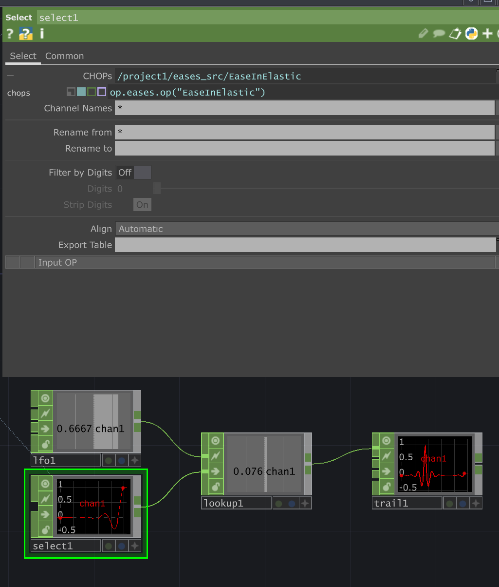
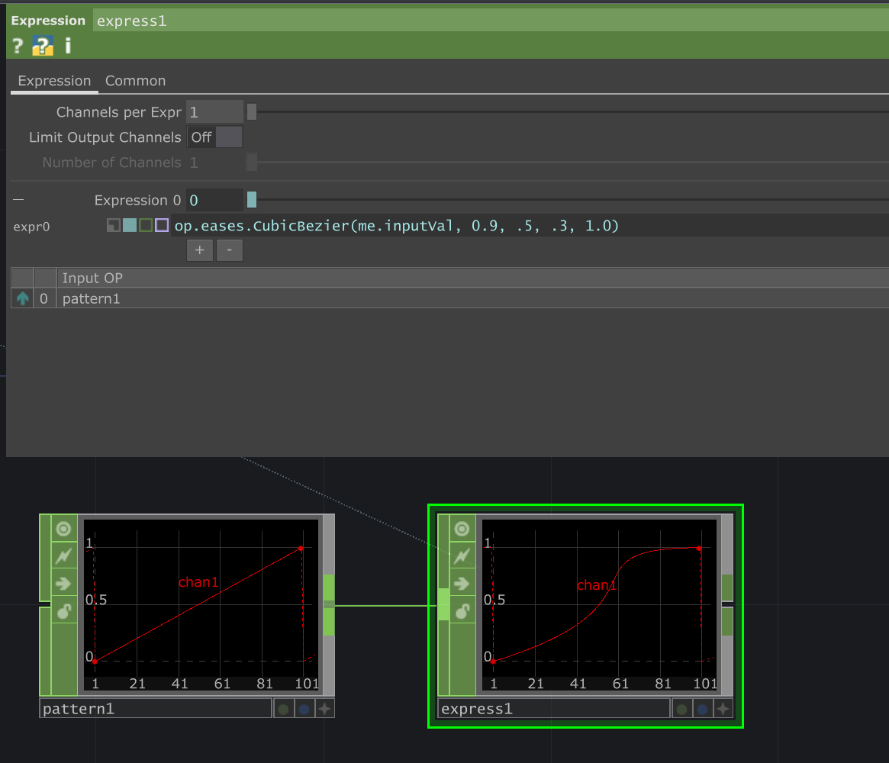

# Touch Eases
A tox asset used to create easing chops that can be sampled. This tool is basically just a wrapper of the amazing tools [easings.net](https://github.com/ai/easings.net) and [ofxAnimatable](https://github.com/armadillu/ofxAnimatable). It can be used to ease chop driven animations which is especially useful when connected to triggers and timers.

## Usage

To use the eases you need to:

1. Create a `select CHOP` to choose the ease. In the path set it to expression mode and type `op.eases.op("NameOfTheEaseYouWant")`. You can find the name of all the eases by viewing the ease COMP.
2. You will need your tween value to be clamped between 0 and 1.
3. Use a `lookup CHOP` with the tween and the ease.



You can either copy and paste the component into your touch file or use the released `eases.tox` file available in `./release` or from the [release page](https://github.com/JohnENoonan/touch-eases/releases).

### Adding New Functions
To add a new function, simply edit `src/scripts/easesExt.py` and create the new function following the following syntax:
```python
# function must start with capitalized "Ease"
def EaseFunctionName(self, x):
	# ... logic here
	return x # return a float
```

If you need a helper function do not expose it or prepend "Ease"

### Custom Cubic Easing
If you just need a simple custom cubic function you can make your own by using `op.eases.CubicBezier()`. Create a setup as depicted below and edit the control points to the bezier through the 4 variables



The variables sent into the function are 
```python
CubicBezier(x, firstx, firsty, lastx, lasty, tx=1.0, ty=1.0)
"""
Implmentation taken from https://github.com/armadillu/ofxAnimatable
x: tween value
first[x,y]: first control points
last[x,y]: last control points
"""
```
